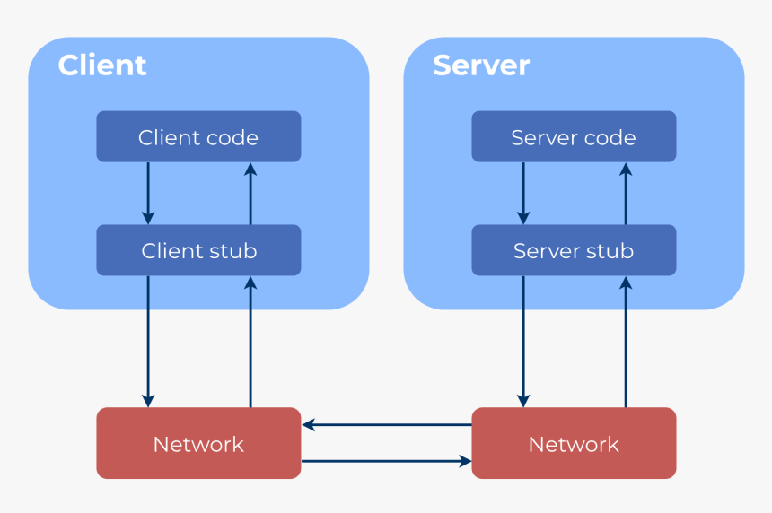

class: center, middle, inverse, small-images

# HTTP and Node.js
## How you can serve a website from your garage and call it a startup


---
class: inverse

# Will this be a boring workshop?

Well that's your call. This is what's going to happen:
1. Introduction to programming in **Flutter** (e **Dart**)
2. Overview of the codebase of **uni**
3. Getting jiggy with it

    - Running the app in your phone/emulator
    - Creating the UI to represent an exam
    - Viewing and creating fictional exams to understand how the app works
    - Seeing your exams through your UI

---

# Requirements for this workshop
Flutter SDK must be installed in the version 1.12.13.
(If you don't havbe it installed now, you probably won't have the time to do it now 👀)


---
class: center, middle, inverse

# HTTP
## Holy-sh*t, This Title Pops

--

### No, but really
### .highlight[Hypertext Transfer Protocol]

---

# Programming 101

Apart from variables and flow control and a few other basic concepts in programming, functions are pretty much **required** if you want to keep your code organized and readable.

It allows for code splitting in a semantically organized way.

.center[
```javascript
function main() {
    const firstName = "Nucleo";
    const lastName = "Informatica";

    console.log(
        getFullName(firstName, lastName)
    );
}

function getFullName(firstName, lastName) {
    return firstName + " " + lastName;
}
```
]

---

# Basic function structure

Usually, a function has the following sections:

.center[
```javascript
function myFunction(arg) {

    /** Validate Arguments                  **/
    /** ----------------------------------- **/
    /** Internal logic, which               **/
    /** may include calling other functions **/
    /** ----------------------------------- **/
    /** Return something                    **/

}
```
]

---

# Who you're gonna call?

Functions can also be called from outside the local process! That's usually called RPC (Remote Procedure Invocation)

.height-limit-400[]

---

# ~~Ghostbusters~~ RPC

With RPC, clients have access to a stub they call as if it were a local function.

However, that call is sent to another process (Can be remote or not) to be executed, and after that remote invocation responds, the stub returns the response, as if it were a local function. For the client, it's completely transparent.

This implies that the client always has access to:
* Response types 
* Possible errors/exceptions
* Available methods to call

---

# ~~Ghostbusters~~ RPC

.center[
```java
public interface BeverageServiceStub {
    public List<Double> getPrices();

    public Integer getStock(BeverageType beverage) 
        throws InvalidBeverageException;
    
    public Integer buy(BeverageType beverage, PaymentMethod payment) 
        throws InvalidBeverageException, 
        InvalidPaymentMethodException, 
        InsufficientCreditException;

    (...)
}
```
]

* Each language must have its own stub implementation to be able to call the remote service.

---
# HTTP

HTTP is a protocol used to communicate between two machines, currently used in web applications.

In a simple form:

1. Client makes a request
1. Server receives and handles the request
1. Server sends a response
1. You get to see cats on your screen

---

# REST to the RESCue

REST (Representational State Transfer) uses HTTP Status and URI rules to give meaning to calls and represent resources and operations.

Instead of .dense[`GET /getStock?beverageType=water`]

we have .dense[`GET /beverages/water/stock`]

<hr>

<div class="flex-columns">
<div>
Instead of 
.sparse[
```bash
POST /buy
{
    beverageType: water,
    quantity: 2,
    paymentMethod: {
        type: "credit-card",
        id: "1111-1111-1111-1111"
        ...
    }
}
```
]
</div>

<div>
we have
.sparse[
```bash
POST /water/buy
{
    quantity: 2,
    paymentMethod: {
        type: "credit-card",
        id: "1111-1111-1111-1111"
        ...
    }
}
```
]
</div>
</div>

---

# REST

REST focuses on **Resources** and **Operations**, instead of behaviors, like RPC. You don't call functions. You don't even know which functions exist. Only need to know about resources, and what you can do with those.

Often, the same URL is used but, by changing the HTTP Method, it gives a completely different meaning:

.dense[
```bash
POST /posts/new # Creates a new post
```
]

.dense[
```bash
GET /posts/new # Fetches the latest posts
```
]

---

# HTTP Status

Each HTTP Response has an associated Status code.

* .dense[`1XX`] Information
* .dense[`2XX`] Success
* .dense[`3XX`] Redirects
* .dense[`4XX`] Client error
* .dense[`5XX`] Server error

---

# HTTP Status

Some examples:

* .dense[`201 Created`] After a successful creation of a resource
* .dense[`301 Moved Permanently`] Useful for crawlers to know when a webpage has been moved to another location
* .dense[`401 Unauthorized`] Requires authentication to access the resource
* .dense[`404 Not Found`] The requested resource does not exist
* .dense[`418 I'm a teapot`] An HTTP easter-egg
* .dense[`503 Service Unavailable`] The server is not ready to handle the request. Maybe it's under heavy load, or undergoing maintenance

---

class: center, middle, inverse,

# CORS
## Currently Out of Rad Subtitles

--

### No, but really
### .highlight[Cross-Origin Resource Sharing]

---

# CORS

CORS (Cross-Origin Resource Sharing) is a mechanism that uses additional HTTP headers to tell a browser to let a web application running at one origin (domain) have permission to access selected resources from a server at a different origin.

Due to this, you **cannot** make requests to services in different locations by default. This is the most common error for beginner web developers.


---

# From browser to server and back

What happens when you type https://ni.fe.up.pt into the url bar on your browser?

1. It will try to find the corresponding IP (check cache).
1. If no mapping found, query DNS servers
1. Initiate a TCP connection with the server
1. Send an .dense[`HTTPS GET /`] request (sending additional informational headers along)
1. The server will receive the request and handle it (in this case generate an HTML page --- Server Side Rendering)
1. The Server sends the HTTP response with headers and HTML
1. Your browser renders NI's website

---

# HTTP web server applications

> The server will receive the request and handle it

Web applications are simply programs that listen for requests and send responses, using the HTTP protocol.

Almost any language has its version of an http server module.

The most common are Java, Python, C# and Node.js.

Today, we'll look specifically into .highlight[Node.js]

---

class: center, middle, inverse

# Node.js
### Almost Heaven

---

class: center, middle, inverse

# Node.js
## Almost Heaven
### West Virginia

---

class: center, middle, inverse

# Node.js
## Almost Heaven
### ~~West Virginia~~
### JavaScript on the server!

# 

# 

I am running out of good subtitles, really

---

# Node.js

.highlight[Node.js] is a server-side language that uses V8 JavaScript engine, which means you can use (almost) the same language you have to use on the browser, but now on the server as well!

.center[
```javascript
const http = require('http');

const server = http.createServer(function (req, res) {
    res.write('Hello World!'); // write a response to the client
    res.end(); // end the response
});

server.listen(80); //the server listens on port 80 (HTTP default)
```
]

---

# Node.js

.center[
```javascript
const server = http.createServer(function (req, res) {
    const endpoint = request.url;

    if(endpoint === "/") processHomepage(req, res);
    if(endpoint === "/about") processAboutPage(req, res);
    if(endpoint === "/store") processStorePage(req, res);
    (...)
});
```
]

---

# Node.js + Express.js = 🤍

Express.js is a web framework that abstracts some of the work involved in creating a web server in Node.js.

.center[
```javascript
const express = require('express')
const app = express()
const port = 80

app.get('/', (req, res) => {
  res.send('Hello World!')
})

app.listen(port, () => {
  console.log(`Example app listening at http://localhost:${port}`)
})
```
]

---
class: center, middle, inverse

# Wait, did you say JS?
## JS means .highlight[JavaScript] and although it has "Java" in the name, it has NOTHING to do with it, apart from also being a programming language

---
class: center, middle, inverse

# JavaScript Theory
## Because you can't hate what you don't know

---

# Variables

.center[
```javascript
let foo; // declared but not initialized - its value is undefined
let bar = 5 // declared and initialized
const baz = "buzz" // also declared and initialized, but constant
```
]

---

# const vs let

Both `const` and `let` serve to declare variables but there are some differences:

* `let` allows the variable to be re-declared, that is, its reference or value can change
* `const` prevents this re-declaration, but it .highlight[does not] prevent mutation of non-primitive types such as Array or Object

.center[
```javascript
const a = [1]
console.log(a) // [1]
a.push(2)
console.log(a) // [1, 2]

a = [1,2,3] // Error!
```
]

To prevent mutation, use `Object.freeze()`


---

# Functions

<div class="flex-columns-center">
<div>
.center[Normal Syntax]
.sparse[
```javascript
function foo(bar) {
    return bar === "baz";
}
```
]
</div>
<div>
.center[Arrow Function Syntax]
.sparse[
```javascript
const foo = (bar) => bar === "baz";
```
]
.sparse[
```javascript
const foo = (bar) => {
    // Don't do this, it's just to show 
    // a multiline version
    const ret = bar === "baz";
    return ret;
}
```
]
</div>
</div>

Functions can be variables too! They are .highlight[first-class citizens]. 

They can be passed as parameters, can be returned from other functions, and can be tested for equality.

---

# Scopes

.center[
```javascript
const a = "global"

function func() {
    console.log(a) // global
    
    const a = "function";
    console.log(a) // function
    
    if(a) {
        const a = "block";
        console.log(a) // block
    }
    
    console.log(a) // function
}

console.log(a) // global
```
]

---

# Hey! But I've seen some vars around!

In fact, before ES6, variable declaration used to be done with the `var` keyword. That is no longer the standard way and is discouraged, since it had some memory leak problems.

Also, `var` is .highlight[function scoped], which means that the declaration would attach to the nearest function scope, unlike `let` or `const`, which belong to their blocks (ifs, loops, etc)

---

# Objects

In JavaScript, everything that is not a primitive type (string, number, boolean, etc) is an .highlight[object]. Even arrays and functions are objects.

Objects are a map-like structure that stores keys and values. The keys can be strings or numbers, but values can be whatever type you want.

.center[
```javascript
const obj = {
    myKey1: 1
    key2: {
        innerKey: true
    }
}

obj.key2.innerKey = false;
obj["myKey1"]++
```
]

---

# Arrays

Arrays are a special kind of objects, which contain a list of elements of any type. You can mix types in a single array, although you probably shouldn't.

.dense[
```javascript
const arr = [1,2,3,4];
const evenNumbers = arr.filter(num => num % 2 === 0); 
// [2,4]
```
]

.dense[
```javascript
const numberLabels = arr.map(num => `${num}-${getNumberLabel(num)}`); 
// ["1-One", "2-Two", "3-Three", "4-Four"] (assuming we have a function getNumberLabel that returns a label for a given number)
```
]

.dense[
```javascript
const sum = arr.reduce((total, current) => total + current, 0); 
// 10
```
]

---

# Array methods

These functions always return a .highlight[new] array (or value, in case of `.reduce`). They never mutate the original object, unless you specifically do it in the body of these functions (which you shouldn't)

You can combine these utilities and create a pipeline of changes for more complex stuff.

There are more functions to use such as `.find()`, `.every()` or `.join()`, the MDN docs are a good start to understand them.

---

# Iterating Arrays

Apart from the classic `for(let i = 0; i < arr.length; i++)`, you have the `for..in` and `for..of` loops.
<div class="flex-columns-center">
<div>
.dense[
```javascript
const arr = ["foo", "bar", "baz"];
for(const key in arr) {
    console.log(key)
}
// 0
// 1
// 2
```
]
</div>

<div>
.dense[
```javascript
const arr = ["foo", "bar", "baz"];
for(const key of arr) {
    console.log(key)
}
// "foo"
// "bar"
// "baz"
```
]
</div>
</div>

---

# Iterating Objects

<div class="flex-columns-center">
<div>
.dense[
```javascript
const obj = {foo: true, bar: false};
for(const key in obj) {
    console.log(key)
}
// "foo"
// "bar"
```
]
</div>

<div>
.dense[
```javascript
const obj = {foo: true, bar: false};
for(const key of obj) {
    console.log(key)
}
// true
// false
```
]
</div>
</div>

---

# What sorcery is *this* ?

The `this` keyword generally refers to the current context of execution. It is implicitly passed when calling functions.

* Inside a function, it refers to the context of where the function was called from, unless otherwise specified.

* Under normal circumstances, `this` will refer to the global object in Node.js (equivalent to the `window` object in the browser)
* If a function is an object property, `this` will refer to the object itself. This is useful to have fields that derive from others.

.center.dense[
```javascript
const person = {
    name: "John",
    surname: "Smith",
    getFullName: function() { return this.name + " " + this.surname; }
}
```
]

---

# What sorcery is *this* ?

Similarly to the objects' behavior, inside a class, `this` corresponds to the class instance. After all, Classes are glorified objects.

.center[
```javascript
class Person {
    constructor(name, surname) {
        this.name = name;
        this.surname = surname;
    }
    
    getFullName() {
        return this.name + " " + this.surname;
    }
}
```
]

---

# What's this, Mr. Arrow?

The biggest difference between normal functions and arrow functions is that arrow functions do not bind their own `this`.

Instead, they inherit the one from the parent scope, which is called "lexical scoping". This makes arrow functions to be a great choice in some scenarios but a very bad one in others.

This is why you cannot use arrow functions in class methods, for example.

---

# Super Example

.center[
```javascript
class Hero {
  constructor() {
    this.powerName = "Super Punch"
    this.buildSuperPower()
  }

  printPowerName() {
    console.log("this", this)
    console.info(this.powerName + " is ready!")
  }

  buildSuperPower() {
    console.info("Initiated Timer");
    setTimeout(this.printPowerName, 500)
    //setTimeout(() => this.printPowerName(), 500)
  }
}

const hero = new Hero()
```
]

---

# Super Example
The code as is (with L14 being executed) will print "undefined is ready!" since the this that is passed to the printPowerName is the context of the setTimeout upon invocation.

If an arrow function is used instead, the this corresponds to the context of where the function is defined, which is the context of buildSuperPower, which in turn will be the Hero instance. In this case, the print is correct: "Super Punch is ready!"

---

class: center, middle, inverse, small-images

# This time the title is in the subtitle
## I Promise

---

# Promises

Imagine MIEIC's professors were JavaScript entities. Imagine you called the method `getGrades()`. It would obviously take too long, right?

If only there was a way for you to do something else while they don't answer back... They could **promise** they would answer some time in the future, and you would go on your way, only to face another teacher that didn't have the grades ready...

---

# Promises

Well, Promises are exactly that: Structures that eventually turn into data or error out. They have 3 possible states:

* Pending: While not fulfilled or rejected
* Fulfilled: When the work has finished, represents the result
* Rejected: When some error occurred, represents the error

.center[
```javascript
const sleep = (time) => new Promise((resolve) => {
    setTimeout(()=>{resolve()}, time)
})

sleep(1000).then(() => {console.log("Time's up!")})

console.log("I can't wait!"); // This will execute first
```
]

---

# Promises, but better

## Async/Await Syntax

```javascript
const longFunction = () => new Promise((resolve, reject) => {
    try {
        const {result, error} = doSomeLongComputation();
        if(error) return reject(error)

        return resolve(result);

    } catch (err) {
        reject(err)
    }
})

longFunction()
    .then((value) => { console.log(value) })
    .catch((err) => { console.error(err) })
```

---

# Promises, but better

## Async/Await Syntax

```javascript
const longFunction = async () => {
   
    const {result, error} = doSomeLongComputation();
    if (error) throw error

    return result;
    
})

const someOtherFunction = async () => {
    try {
        const result = await longFunction();
    } catch (err) {
        console.error(err)
    }
} 
```

---

class: center, middle, inverse

# Node.js specifics
## This introduces the next module

# 

# 

--

#### You'll understand this subtitle in a few slides...

---

# npm

.highlight[npm] is the package manager for Node.js. The basic commands you need to know are:

.dense[
```bash
# Bootstraps the project, creating the package.json
npm init
```
]

.dense[
```bash
# Adds a dependency to package.json and installs it locally 
npm install <package>
```
]

.dense[
```bash
# Runs a command as defined in the `scripts` section on package.json
npm run <cmd>
```
]

---

# User defined modules

Usually in Node.js applications, you will split the code in multiple files and folders, creating .highlight[modules].

Each module exports whatever it needs, including variables (will be constant) or functions, which can be imported by any other module (as long as there is no circular dependency 👀)

.dense[
```javascript
const myVar = "CONSTANT_STUFF"

module.exports = myVar;

// Import with
const importedVar = require("./path-to-other-module") // "CONSTANT_STUFF"

```
]

To export multiple values, export an object with a property for each thing you want to share.

---

# Built-in Modules

Node.js includes some modules such as .highlight[fs] and .highlight[path] to help you interact more easily with the file system.

.center[
```javascript
const fs = require("fs");
const path = require("path");

const filePath = path.join(__dirname, <file path relative to file>);

fs.readFile(filePath, "utf8", (err, data) => {
    // Handle Data
});

```
]

Let's see an example...
