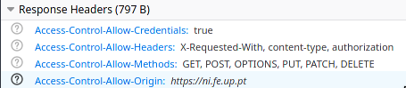

class: center, middle, inverse, small-images

# HTTP and Node.js
## How you can serve a website from your garage and call it a startup


---
class: inverse

# Will this be a boring workshop?

Well that's your call. This is what's going to happen:
1. Introduction to programming in **Flutter** (e **Dart**)
2. Overview of the codebase of **uni**
3. Getting jiggy with it

    - Running the app in your phone/emulator
    - Creating the UI to represent an exam
    - Viewing and creating fictional exams to understand how the app works
    - Seeing your exams through your UI

---

# Requirements for this workshop
Flutter SDK must be installed in the version 1.12.13.
(If you don't havbe it installed now, you probably won't have the time to do it now 👀)


---
class: center, middle, inverse

# HTTP
## Holy-sh*t, This Title Pops

--

### No, but really
### .highlight[Hypertext Transfer Protocol]

---

# Programming 101

Apart from variables and flow control and a few other basic concepts in programming, functions are pretty much **required** if you want to keep your code organized and readable.

It allows for code splitting in a semantically organized way.

.center[
```javascript
function main() {
    const firstName = "Nucleo";
    const lastName = "Informatica";

    console.log(
        getFullName(firstName, lastName)
    );
}

function getFullName(firstName, lastName) {
    return firstName + " " + lastName;
}
```
]

---

# Basic function structure

Usually, a function has the following sections:

.center[
```javascript
function myFunction(arg) {

    /** Validate Arguments                  **/
    /** ----------------------------------- **/
    /** Internal logic, which               **/
    /** may include calling other functions **/
    /** ----------------------------------- **/
    /** Return something                    **/

}
```
]

---

# Who you're gonna call?

Functions can also be called from outside the local process! That's usually called RPC (Remote Procedure Invocation)

.height-limit-400[]

---

# ~~Ghostbusters~~ RPC

With RPC, clients have access to a stub they call as if it were a local function.

However, that call is sent to another process (Can be remote or not) to be executed, and after that remote invocation responds, the stub returns the response, as if it were a local function. For the client, it's completely transparent.

This implies that the client always has access to:
* Response types 
* Possible errors/exceptions
* Available methods to call

---

# ~~Ghostbusters~~ RPC

.center[
```java
public interface BeverageServiceStub {
    public List<Double> getPrices();

    public Integer getStock(BeverageType beverage) 
        throws InvalidBeverageException;
    
    public Integer buy(BeverageType beverage, PaymentMethod payment) 
        throws InvalidBeverageException, 
        InvalidPaymentMethodException, 
        InsufficientCreditException;

    (...)
}
```
]

* Each language must have its own stub implementation to be able to call the remote service.

---
# HTTP

HTTP is a protocol used to communicate between two machines, currently used in web applications.

In a simple form:

1. Client makes a request
1. Server receives and handles the request
1. Server sends a response
1. You get to see cats on your screen

---

# REST to the RESCue

REST (Representational State Transfer) uses HTTP Status and URI rules to give meaning to calls and represent resources and operations.

Instead of .dense[`GET /getStock?beverageType=water`]

we have .dense[`GET /beverages/water/stock`]

<hr>

<div class="flex-columns">
<div>
Instead of 
.sparse[
```bash
POST /buy
{
    beverageType: water,
    quantity: 2,
    paymentMethod: {
        type: "credit-card",
        id: "1111-1111-1111-1111"
        ...
    }
}
```
]
</div>

<div>
we have
.sparse[
```bash
POST /water/buy
{
    quantity: 2,
    paymentMethod: {
        type: "credit-card",
        id: "1111-1111-1111-1111"
        ...
    }
}
```
]
</div>
</div>

---

# REST

REST focuses on **Resources** and **Operations**, instead of behaviors, like RPC. You don't call functions. You don't even know which functions exist. Only need to know about resources, and what you can do with those.

Often, the same URL is used but, by changing the HTTP Method, it gives a completely different meaning:

.dense[
```bash
POST /posts/new # Creates a new post
```
]

.dense[
```bash
GET /posts/new # Fetches the latest posts
```
]

---

# HTTP Status

Each HTTP Response has an associated Status code.

* .dense[`1XX`] Information
* .dense[`2XX`] Success
* .dense[`3XX`] Redirects
* .dense[`4XX`] Client error
* .dense[`5XX`] Server error

---

# HTTP Status

Some examples:

* .dense[`201 Created`] After a successful creation of a resource
* .dense[`301 Moved Permanently`] Useful for crawlers to know when a webpage has been moved to another location
* .dense[`401 Unauthorized`] Requires authentication to access the resource
* .dense[`404 Not Found`] The requested resource does not exist
* .dense[`418 I'm a teapot`] An HTTP easter-egg
* .dense[`503 Service Unavailable`] The server is not ready to handle the request. Maybe it's under heavy load, or undergoing maintenance

---

class: center, middle, inverse,

# CORS
## Currently Out of Rad Subtitles

--

### No, but really
### .highlight[Cross-Origin Resource Sharing]

---

# CORS

CORS (Cross-Origin Resource Sharing) is a mechanism that uses additional HTTP headers to tell a browser to let a web application running at one origin (domain) have permission to access selected resources from a server at a different origin.

Due to this, you **cannot** make requests to services in different locations by default. This is the most common error for beginner web developers.


